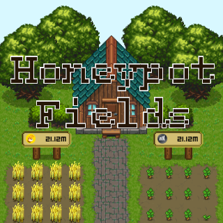

# Honeypot Fields Client



The Honeypot fields client is designed to operate as both an xNFT and web app. Currently only the Phantom Wallet is supported. Link to [Solana program backend](https://github.com/blockiosaurus/speedrun-program).

# Play the Demo
The current demo is hosted at https://speedrun-xnft.vercel.app/

## Controls
Select items from the inventory bar at the bottom and click a location on the map to plant the item.

The avatar moves around as you place your mouse or fingers at the edge of the screen.

## Gameplay Video


# Local Build and Development

## Developing

Once you've installed Backpack, get started building your xNFT with these steps. Note that the packages here will always use the latest, which correspond to the latest tagged build of Backpack. If you have unexpected issues, make sure your package versions match the app version.

Further documentation: https://docs.xnfts.dev/getting-started/introduction

### Install

First, install dependencies.

```
yarn
```

### Run the dev server

Then, run the dev server with hot reloading

```
yarn dev
```

### Open the Simulator in Backpack

Now that you have your xNFT dev server running, open it in the Backpack simulator to see it run.

That's it!


## Build & Publish

Once you're done and ready to publish, build your xNFT:

```
yarn build
```

Test the newly created build in `dist/index.html` in the simulator:

```
yarn start
```

Once everything looks good head over to [xnft.gg](https://www.xnft.gg) to publish your xNFT!
